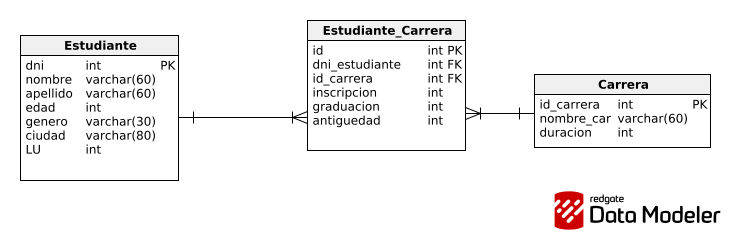

# Arquitectura Web - Entrega 2: JPA y Hibernate

Este proyecto corresponde al Trabajo Práctico N° 2, donde se implementa el diseño de una base de datos relacional y el acceso a datos mediante JPA (Jakarta Persistence API) y Hibernate.

## Estado del Proyecto

### Inciso 1: Diseño del Dominio
- [x] **Diagrama Entidad-Relación (DER):** Modelado conceptual y lógico completado.
    
- [x] **Clases (Diagrama de Objetos):** Clases básicas creadas en el paquete `entitys` respetando fielmente la estructura de los archivos `.csv` provistos (`estudiantes.csv`, `carreras.csv`, `estudianteCarrera.csv`).

## Notas y Decisiones de Diseño
* **Claves Primarias:** Se determinó usar el `DNI` como PK para `Estudiante` en base a los datos provistos en los archivos CSV. La Libreta Universitaria (`LU`) queda como un atributo `UNIQUE`.
* **Tabla Intermedia:** Para la relación Muchos a Muchos entre `Estudiante` y `Carrera`, se optó por crear una entidad explícita `Inscripcion` dado que la relación contiene atributos propios (`inscripcion`, `graduacion`, `antiguedad`) y un identificador propio en el dataset (`id`).

